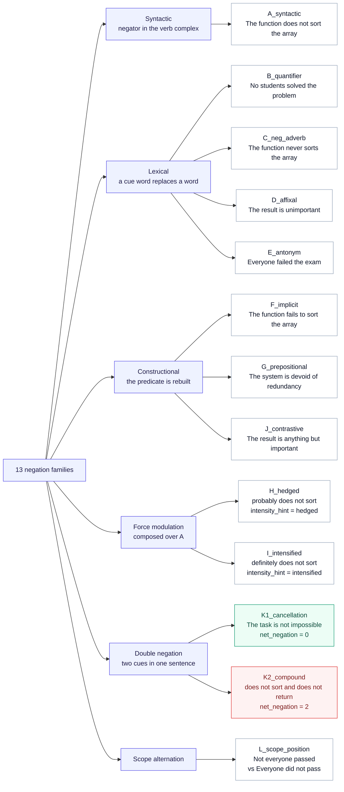
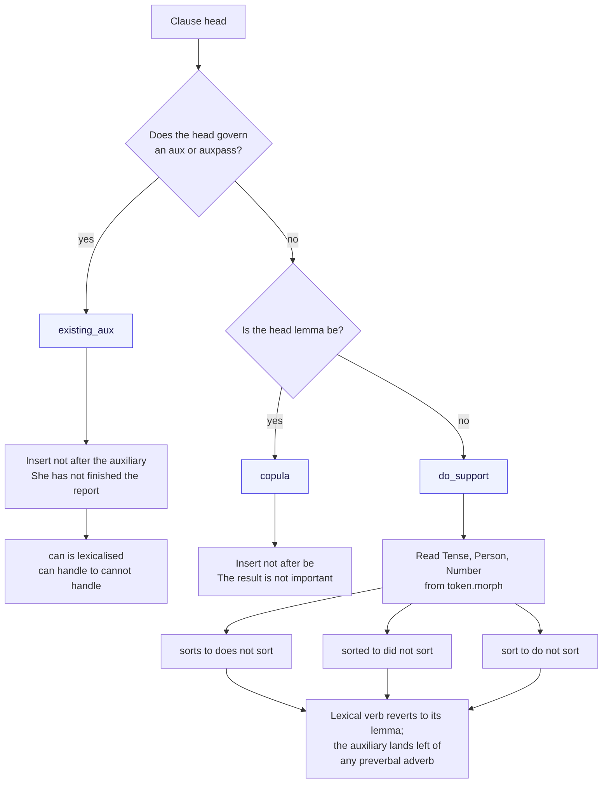
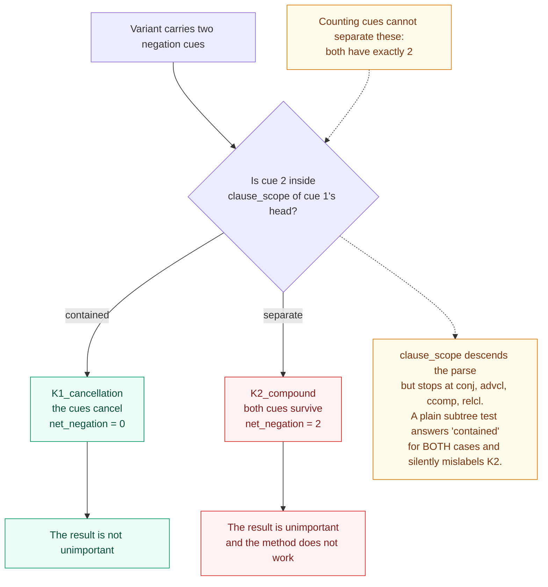
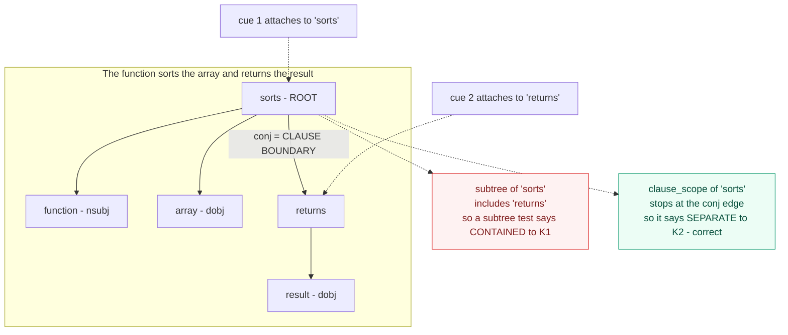
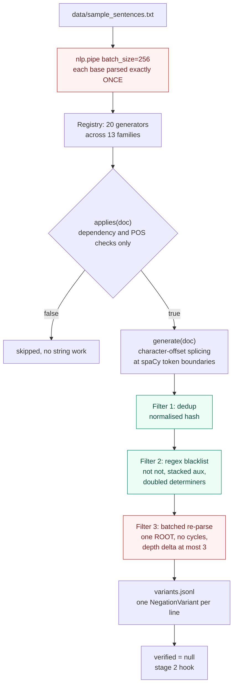
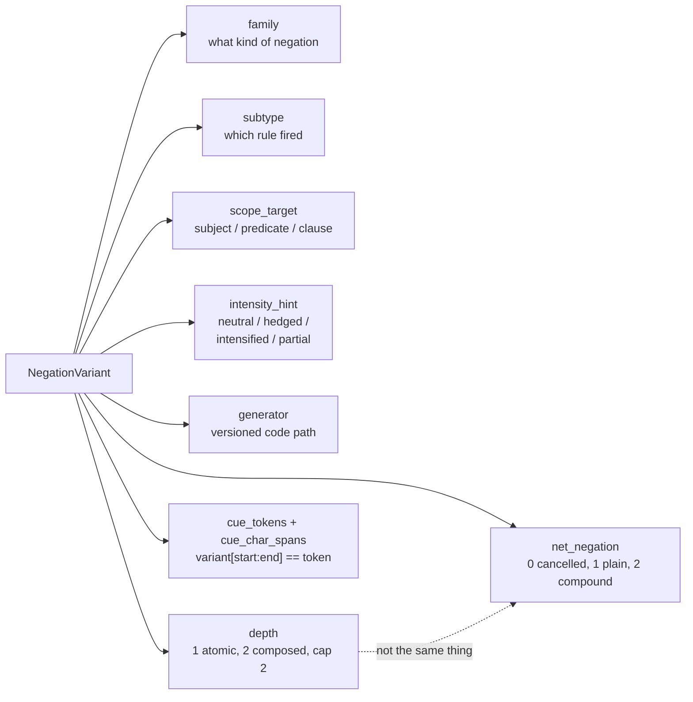
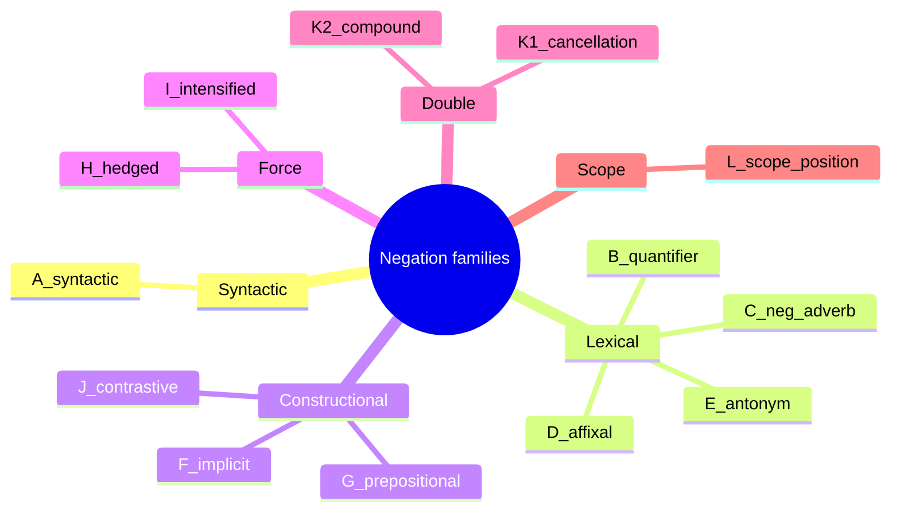

# Diagrams

Mermaid sources for the negation-variant pipeline. Renders as-is on GitHub,
Obsidian, Notion, VS Code preview, and mermaid.live.

## 1. Family taxonomy

## 2. Families by subtype

```mermaid
flowchart TD
    A["A_syntactic"] --> A1["copula<br/>The result is not important"]
    A --> A2["existing_aux<br/>The model cannot handle noise"]
    A --> A3["do_support<br/>The function does not sort the array"]

    B["B_quantifier"] --> B1["some_to_no"]
    B --> B2["all_to_none_of"]
    B --> B3["every_to_no"]
    B --> B4["both_to_neither"]
    B --> B5["always_to_never"]
    B --> B6["someone_to_nobody<br/>something_to_nothing<br/>somewhere_to_nowhere"]

    C["C_neg_adverb"] --> C1["absolute<br/>never"]
    C --> C2["partial<br/>hardly, barely, rarely,<br/>seldom, scarcely"]

    D["D_affixal"] --> D1["prefix_un, prefix_in, prefix_im,<br/>prefix_ir, prefix_il, prefix_non, prefix_dis"]
    D --> D2["suffix_less<br/>useful to useless"]

    E["E_antonym"] --> E1["antonym_adj"]
    E --> E2["antonym_verb"]
    E --> E3["antonym_adv"]

    F["F_implicit"] --> F1["fails_to, refuses_to,<br/>neglects_to, ceases_to"]
    F --> F2["is_unable_to"]
    F --> F3["denies"]
    F --> F4["lacks"]

    G["G_prepositional"] --> G1["without"]
    G --> G2["devoid_of"]
    G --> G3["free_of"]
    G --> G4["in_the_absence_of"]

    H["H_hedged"] --> H1["maybe_not, possibly_not,<br/>probably_not"]
    H --> H2["might_not, may_not"]

    I["I_intensified"] --> I1["surely_not, definitely_not,<br/>certainly_not, absolutely_not"]
    I --> I2["not_at_all, by_no_means"]

    J["J_contrastive"] --> J1["anything_but"]
    J --> J2["far_from"]
    J --> J3["the_opposite_of"]

    K1["K1_cancellation"] --> KA["cancel_impossible<br/>negative word already in base"]
    K1 --> KB["not_prefix_un<br/>negator plus fresh derivation"]
    K1 --> KC["never_fails_to<br/>adverb over a trigger"]

    K2["K2_compound"] --> KD["do_support+do_support"]
    K2 --> KE["copula+do_support"]
    K2 --> KF["not+prefix_un"]

    L["L_scope_position"] --> L1["subject_scope<br/>Not everyone passed"]
    L --> L2["predicate_scope<br/>Everyone did not pass"]
```

## 3. A_syntactic: the three clause frames

## 4. K1 vs K2: the scope-containment decision

## 5. Why a subtree test is not enough

## 6. Pipeline

## 7. Metadata fields

## Mindmap alternative

Compact version of diagram 1 for slides. Needs Mermaid 10 or newer.

