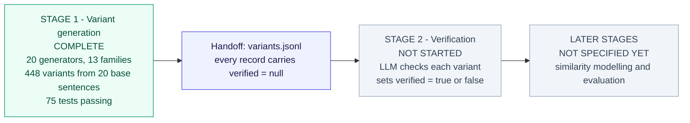
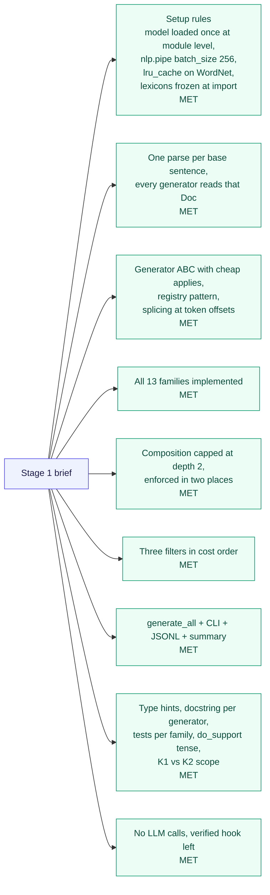
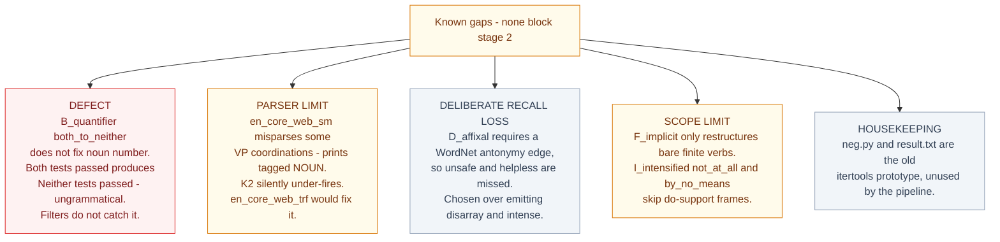
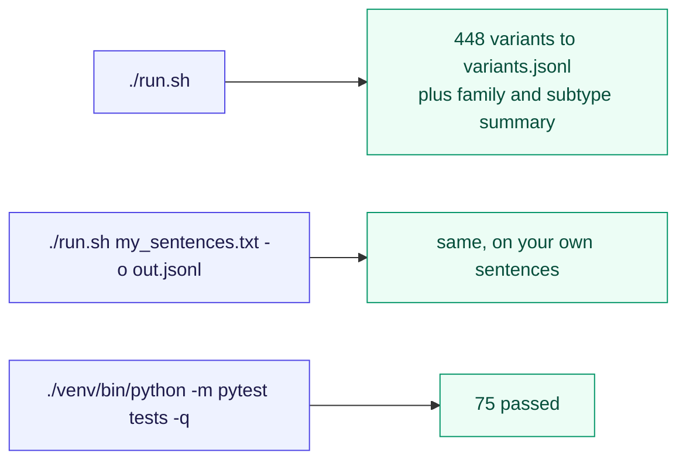

# Project status

Mermaid sources tracking what is built. Same style as `docs/diagrams.md`.
Last updated after stage 1 completion.

## 1. Where the project stands

## 2. Stage 1 build status, module by module

```mermaid
flowchart TD
    ENV["Environment<br/>venv, spaCy 3.8 + en_core_web_sm,<br/>NLTK WordNet, pytest"]

    ENV --> CORE["CORE INFRASTRUCTURE - 12 modules"]
    ENV --> GENS["GENERATORS - 14 modules"]
    ENV --> PIPE["PIPELINE"]
    ENV --> QA["TESTS AND DOCS"]

    CORE --> C1["schema.py<br/>NegationVariant, family constants,<br/>MAX_DEPTH cap"]
    CORE --> C2["nlp_core.py<br/>one spaCy pipeline, lru_cache WordNet,<br/>morphology, clause_scope"]
    CORE --> C3["lexicons.py<br/>all word lists frozen at import"]
    CORE --> C4["splice.py<br/>character-offset Edit, cue tracking"]
    CORE --> C5["frames.py<br/>the three clause frames"]
    CORE --> C6["polarity.py<br/>explicit vs lexical negation"]
    CORE --> C7["scope.py<br/>K1 vs K2 containment decision"]
    CORE --> C8["base.py<br/>Generator ABC, registry, record build"]

    GENS --> G1["A_syntactic - 3 generators<br/>copula, existing_aux, do_support"]
    GENS --> G2["B, C, D, E - 4 generators<br/>lexical families"]
    GENS --> G3["F, G, J - 5 generators<br/>constructional families"]
    GENS --> G4["H, I - 2 generators<br/>composed over A, depth 2"]
    GENS --> G5["K1, K2 - 5 generators<br/>double negation, depth 2"]
    GENS --> G6["L - 1 generator<br/>scope alternation"]

    PIPE --> P1["filters.py<br/>dedup, blacklist, batched re-parse"]
    PIPE --> P2["driver.py<br/>generate_all, parse once per sentence"]
    PIPE --> P3["cli.py + run.sh<br/>JSONL output and summary"]

    QA --> Q1["75 tests across 5 files<br/>one per family, plus do_support<br/>tense table and K1 vs K2 scope"]
    QA --> Q2["README.md<br/>docs/diagrams.md<br/>data/sample_sentences.txt"]

    classDef done fill:#ecfdf5,stroke:#059669,color:#064e3b
    classDef grp fill:#eef2ff,stroke:#4f46e5,color:#1e1b4b
    class ENV,CORE,GENS,PIPE,QA grp
    class C1,C2,C3,C4,C5,C6,C7,C8,G1,G2,G3,G4,G5,G6,P1,P2,P3,Q1,Q2 done
```

## 3. Requirements coverage

## 4. Open items carried into stage 2

## 5. What runs today

